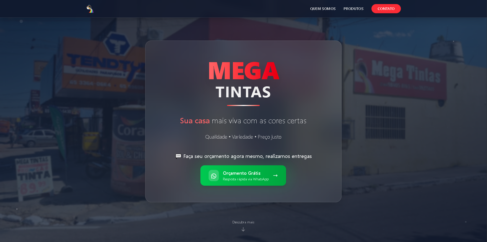
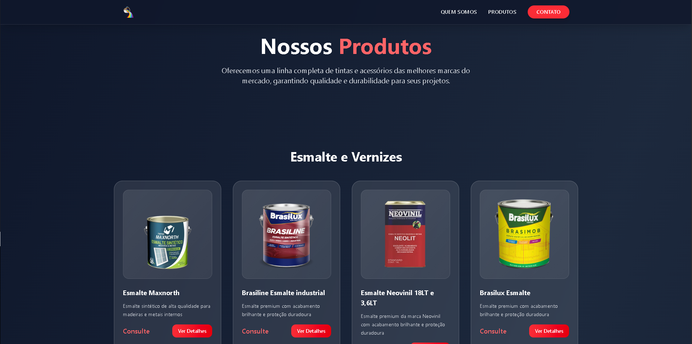
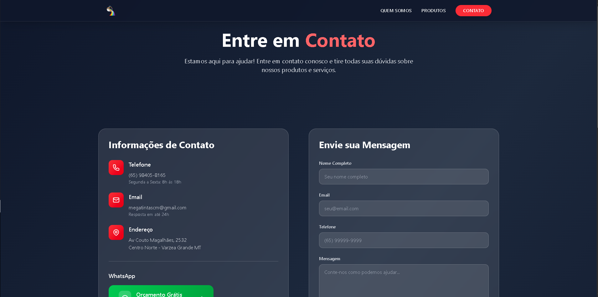

# 🛍️ Mega Tintas - Website Oficial

Este projeto foi desenvolvido para a **empresa Mega Tintas**, com o objetivo de suprir as necessidades de **divulgação online** da loja. O site apresenta os produtos disponíveis, facilita o contato com os clientes via WhatsApp e transmite profissionalismo por meio de um design moderno e responsivo.

---

## ✨ Interface

### 🏠 Página Inicial



### 🎨 Produtos



### 📞 Contato



---

## 🧪 Tecnologias Utilizadas

- **React**
- **TypeScript**
- **Vite**
- **TailwindCSS**
- **Google Tag para conversões (WhatsApp)**
- Deploy com **Vercel**

---

## 🚀 Rodando Localmente

Siga os passos abaixo para rodar o projeto localmente:

```bash
# Clone o repositório
git clone https://github.com/wilzo/lojawebsite.git

# Acesse a pasta
cd lojawebsite

# Instale as dependências
npm install

# Inicie o servidor local
npm run dev
```
